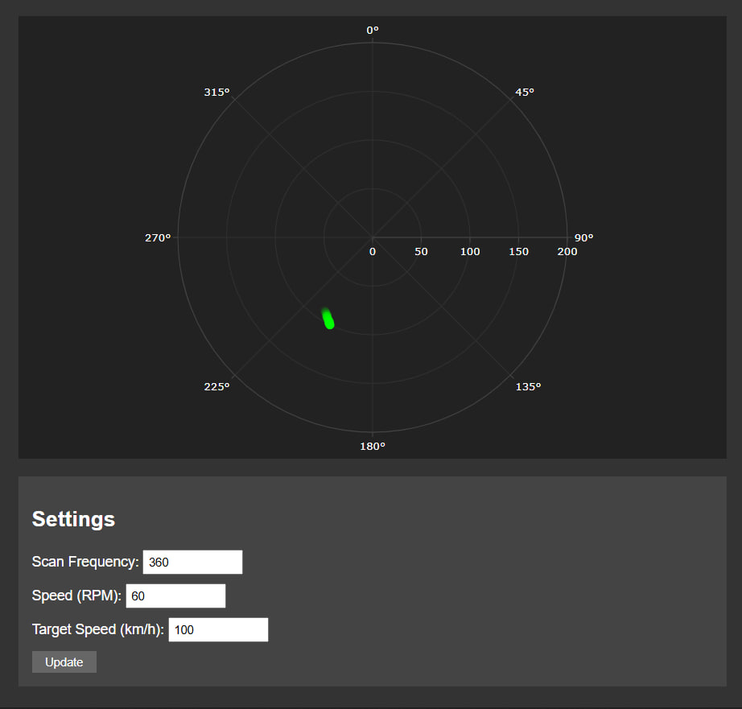
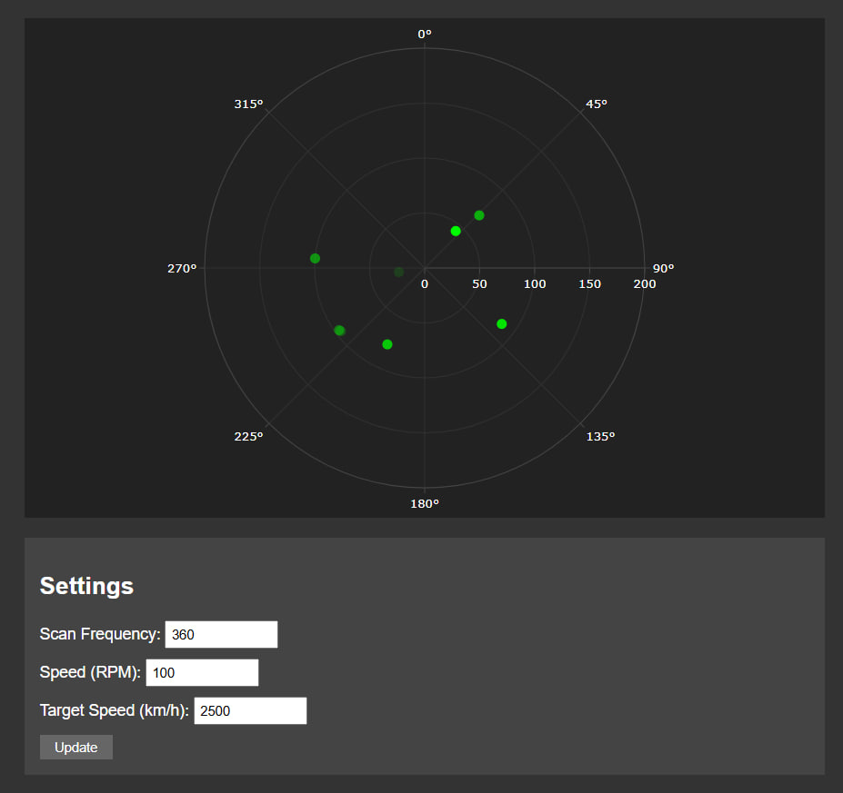

# Лабораторна робота №4: Розробка додатку для візуалізації вимірювань радару
# 
## Мета роботи
Розробити веб-додаток для візуалізації даних радару, отриманих з емульованої вимірювальної частини, та дослідити принципи роботи радіолокаційних систем.

## Теоретичні відомості
У роботі досліджується принцип дії радару (RADAR - Radio Detection and Ranging) - пристрою, що використовує радіохвилі для визначення положення об'єктів у просторі. Основою роботи радару є випромінювання радіохвиль та прийом їх відбиття від цілей. Час затримки між випромінюванням та прийомом сигналу дозволяє визначити відстань до об'єкта за формулою R = (c * t) / 2, де c - швидкість світла, t - час затримки сигналу. Окрім відстані, радар також визначає напрямок до цілі за положенням антени в момент прийому сигналу. Ця інформація дозволяє побудувати повну картину розташування об'єктів у просторі навколо радару.

## Розробка веб-додатку
Для візуалізації даних радару було створено інтерактивний веб-інтерфейс, який відображає дані в полярних координатах. Система працює в режимі реального часу, постійно оновлюючи інформацію про положення цілей через WebSocket з'єднання. У розробленому додатку користувач може керувати параметрами роботи радару через спеціальну панель налаштувань. Серед доступних параметрів є можливість зміни частоти сканування простору, швидкості обертання антени та швидкості руху відстежуваних об'єктів. Інтерфейс також забезпечує візуальне відображення інтенсивності прийнятого сигналу через кольорове кодування точок на графіку.

## Результати роботи

**Початкова конфігурація системи:**

На зображенні представлено роботу системи з початковими налаштуваннями. За таких параметрів частота сканування становить 360 вимірювань за оберт, швидкість обертання антени встановлена на рівні 60 RPM, а швидкість руху цілі складає 100 км/год. При даній конфігурації система демонструє чітке відстеження об'єкта та стабільне оновлення даних на графіку.

**Конфігурація з високою швидкістю:**

Після збільшення швидкості цілі до 2500 км/год у системі спостерігаються значні зміни характеру відображення даних. На радарі з'являється характерний "слід" об'єкта, що рухається, збільшується кількість точок відбиття сигналу, а також розширюється загальна зона виявлення цілі. Такі зміни пов'язані з особливостями взаємодії швидкорухомого об'єкта з радіолокаційною системою.

## Висновки
В процесі виконання лабораторної роботи було створено повноцінний веб-додаток для візуалізації даних радару. Розроблена система успішно виконує обробку та відображення інформації в режимі реального часу, забезпечуючи зручний інтерфейс для керування параметрами радару. Проведене дослідження впливу різних налаштувань на якість відстеження цілей показало високу адаптивність системи до змін умов роботи. Отриманий досвід розробки дозволив краще зрозуміти принципи функціонування радіолокаційних систем та особливості обробки даних у реальному часі.
